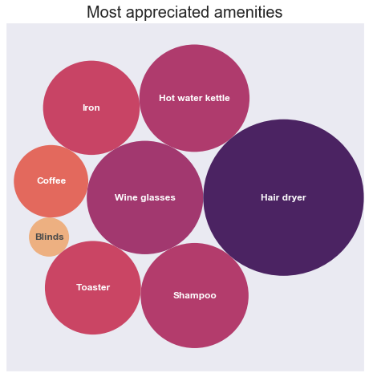
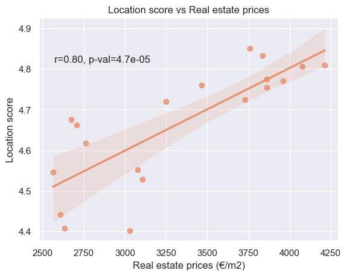
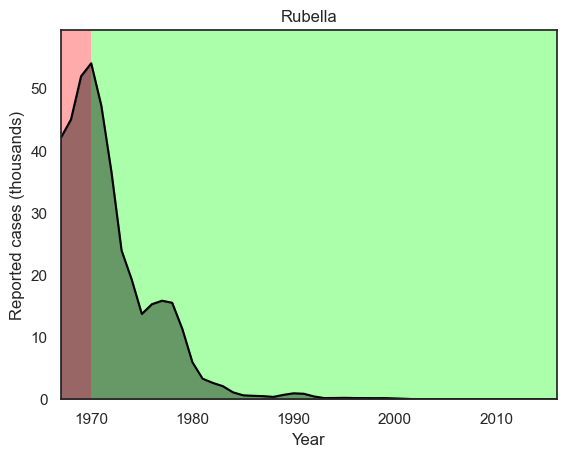
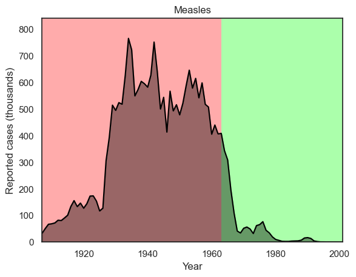

# My data analysis portfolio

## About

This is a collection of data analysis projects on which I worked in my free time.
I created these notebooks mainly as a hands-on way to learn new techniques and get to know new Python libraries. 
I am now (slowly) reviewing the code and publishing it as a sort of *portfolio* of my skills.
 
## How to navigate

Each folder contains a project.
Each project contains a single notebook named 'analysis.ipynb'.
The first cells of the notebooks always contain a markdown summary of the analysis, while the subsequent cells contain the code.

## A quick look

### AirBnb in Brussels

An analysis of the AirBnb accommodations available in Brussels.

<table>
  <tr>
    <td></td>
    <td></td>
  </tr>
</table>

### Impact of vaccines

An analysis of the positive impact of vaccines, based on the historical data provided by [Project Tycho](https://www.tycho.pitt.edu).

<table>
  <tr>
    <td></td>
    <td></td>
  </tr>
</table>

## Built with
The project is entirely written in Python and composed of Jupyter notebooks.

## License
This code is licensed under the BSD-style license found in the LICENSE file in the root directory of this source tree.